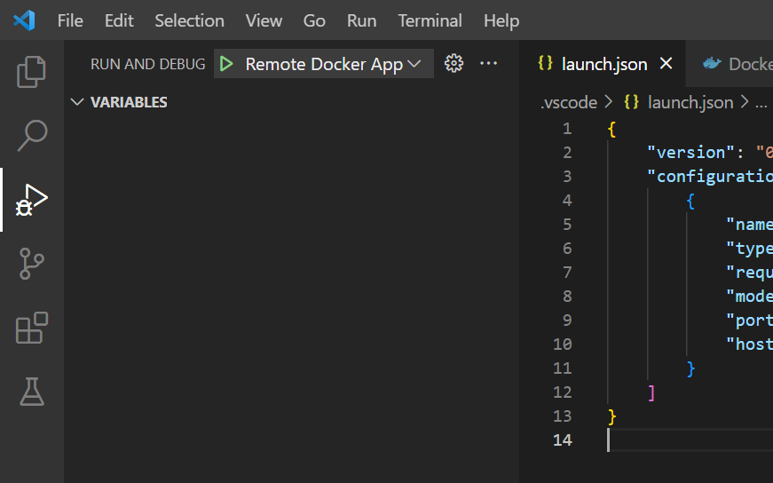
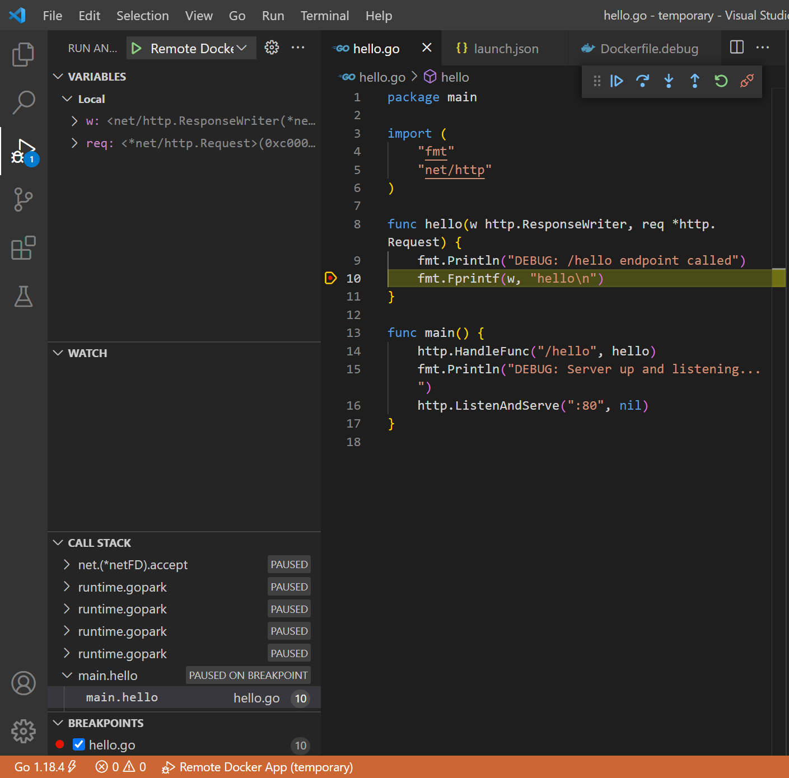

The ability to debug is an important tool for a developer to keep in their toolbox.  While it's ideal to debug by running the application natively, there are scenarios where this either isn't possible or the issue must be reproduced in a particular environment.

The required setup to debug a Go app running inside a Docker container is non-trivial.  In this post I will walk through the configuration to achieve this using VSCode and the [Delve debugger](https://github.com/go-delve/delve).

Consider this simple Go server app which listens on port 80 and has a simple handler at the `GET /hello` endpoint:

```go
package main

import (
	"fmt"
	"net/http"
)

func hello(w http.ResponseWriter, req *http.Request) {
	fmt.Println("/hello endpoint called")
	fmt.Fprintf(w, "hello\n")
}

func main() {
	http.HandleFunc("/hello", hello)
	fmt.Println("Server up and listening...")
	http.ListenAndServe(":80", nil)
}
```

And the Dockerfile:
```docker
FROM golang:1.18-alpine
WORKDIR /app
EXPOSE 80

COPY hello.go ./
ENV GO111MODULE=off
RUN go build -o hello-app .

CMD [ "./hello-app" ]
```
* `golang:1.18-alpine` is the base image we'll build from
* `WORKDIR /app` declares the working directory; all relative paths referenced thereafter are from this location
* The `COPY` directive simply copies files from the host to the image being built
* `RUN go build -o hello-app .` compiles our program, producing the executable file `hello-app`
  * Since we are not working with Go Modules `ENV GO111MODULE=off` is required to build our program correctly
* Finally, `CMD` provides Docker with a run command for our app when the container is started

Build, run, and query with these commands:
```bash
docker build . --tag hello-image
docker run --publish 80:80 --name hello-image hello-server
curl http://localhost/hello
```

_Note: Docker Compose is a more user-friendly tool for managing container lifecycle, but for the sake of simplicity I've decided to work with Docker directly._

Delve provides a server running in the Docker container which VSCode connects to in order to interact with the debugging session.

This requires creating a new Dockerfile with modifications from the original.  We'll call this file `Dockerfile.debug`:
```docker
FROM golang:1.18-alpine
EXPOSE 80 4000
WORKDIR /app
COPY hello.go ./

RUN CGO_ENABLED=0 go install -ldflags "-s -w -extldflags '-static'" github.com/go-delve/delve/cmd/dlv@latest

ENV GO111MODULE=off
RUN CGO_ENABLED=0 go build -gcflags "all=-N -l" -o hello-app .

CMD [ "/go/bin/dlv", "--listen=:4000", "--headless=true", "--log=true", "--accept-multiclient", "--api-version=2", "exec", "/app/hello-app" ]

```
There are a few differences here:
* We install the Delve package with `RUN CGO_ENABLED=0 go install...`
* We've added the flag `-gcflags "all=-N -l"` to the build command.  This is to disable inlining and optimizations that can interfere with debugging.
* `CMD` is now running Delve, telling it to listen for connections on port 4000, and how to run our program

We also need a custom debug configuration for VSCode, stored in `.vscode/launch.json`:
```
{
    "version": "0.2.0",
    "configurations": [
        {
            "name": "Remote Docker App",
            "type": "go",
            "request": "attach",
            "mode": "remote",
            "port": 4000,
            "host": "127.0.0.1"
        }
    ]
}
```

Running the debug container requires slightly different commands:
```bash
docker build . --tag debug-image --file Dockerfile.debug
docker run --publish 80:80 --publish 4000:4000 --name debug-server debug-image
```

* The non-standard filename `Dockerfile.debug` must be explicitly referenced
* There is an additional port to publish, `4000`
* We use a different image tag and container name so we don't overwrite the original build
  * This speeds up build time when switching between the debug and standard environments

At this point we are ready to debug our program!  Go to the _Run and Debug tab_, select `Remote Docker App` and hit the Start Debugging play button.



Set a breakpoint in our program's `hello()` handler function by clicking on the margin to the left of the line number.

Finally, `curl` the server with the command provided earlier, and observe the debugger halting execution!



With our program now running in a debugging session we've gained valuable visibility into runtime internals.  This greatly speeds up the feedback loop when trying to understand why our program isn't behaving the intended way.  Setting breakpoints and stepping through execution with a debugger is pretty seamless.  By contrast adding print statements, building, running, then calling the application is a much slower process.

From here you're free to play around with the many debugger features VSCode offers:  Setting breakpoints, stepping line-by-line through execution with Debug Actions, Inspecting variables' values, and so on.

Here are some references to check out:
* [Debugging with VSCode](https://code.visualstudio.com/docs/editor/debugging)
* My [Go Microservice App](https://github.com/bruc3mackenzi3/go-microservice-template) as a working example of this exercise

Comments and feedback about this tutorial are welcome.  If you worked through the example please share your experience with it.  Happy debugging!
